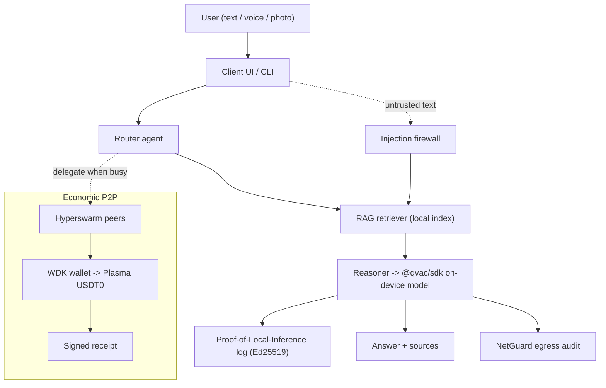

# Nyx architecture

## Layers
1. **Client** — web UI (`public/index.html`) + `cli.js`. Voice/photo are optional
   multimodal inputs (STT/TTS/OCR via @qvac/sdk).
2. **Core** — `src/agents.js` orchestrates: route -> retrieve (`src/rag.js`) ->
   reason (`src/qvac.js`).
3. **Trust** — `src/poli.js` (signed inference log), `verify.js` (independent
   checker), `src/netguard.js` (egress guard), `src/attestation.js` (which model).
4. **Economic P2P** — `src/wallet/wdk.js` (self-custodial wallet) +
   `src/p2p/payments.js` (Plasma USDT0 receipts) for paid, delegated inference.

## Trust model (why a judge should believe it)
- *It runs* -> `bootstrap.sh` / `demo.sh` on a fresh clone.
- *It's local* -> `evidence/netguard.json` (0 egress) + verified PoLI chain.
- *It's what you claim* -> `evidence/attestation.json` + signed receipt + bench.
