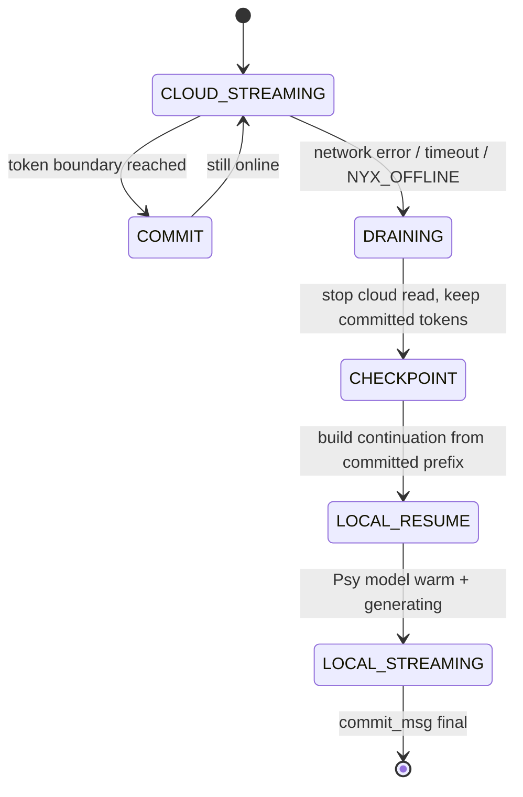

# 01 - Zero-Copy Context Synchronization

**Axis:** Performance. **Status:** [PARTIAL] today, [BLUEPRINT] for the CRDT + KV warm-start.

## Reality check first (so we never get caught lying)

Two phrases in the brief are physically false, and we replace them with the correct
mechanism:

1. *'continue precisely mid-token'* — impossible across two different runtimes. A token
   is the atomic unit of generation; Groq and the local Psy model do not even share
   logits or KV layouts. You cannot resume a half-emitted token. **What is real:**
   resume at the last *committed token boundary*. Because we stream token-by-token, the
   boundary granularity is one token (~3-4 chars), so the user perceives 'no loss'.

2. *'zero-copy'* — meaningful only if both consumers read the *same* memory. We make it
   literal by keeping ONE `ConversationState` object as the single source of truth that
   both the cloud sender and the local model read from. Swapping providers is a pointer
   reassignment, not a serialize/parse round-trip. That is the honest meaning of
   zero-copy here: no re-encoding, no re-indexing, no prompt rebuild.

## The data structure: ConversationState as a CRDT op-log

We model the transcript as an append-mostly **RGA (Replicated Growable Array)** of
message ops, plus an **LWW register** for per-message streaming text. This is CRDT so
the SAME structure works in 04 (P2P) without a rewrite.

```
Op = {
  id:      [lamport, actorId],   // total order; actorId breaks ties
  type:    'add_msg' | 'append_tok' | 'commit_msg' | 'edit',
  ref:     msgId,                // which message this op targets
  payload: { role, text } | { token } | {},
}
```

Rules (conflict-free):
- `add_msg` inserts at position keyed by its lamport id (RGA ordering => deterministic).
- `append_tok` appends to a message's token list; concurrent appends from one writer are
  naturally ordered; cross-writer concurrency is prevented by the single-writer-per-turn
  invariant (only the *active provider* holds the write lease for the in-flight assistant
  message).
- `commit_msg` freezes a message (used as the checkpoint boundary on failover).
- LWW only matters for `edit` (user edits a prior message): highest lamport wins.

Why CRDT if it is single-machine today? Because it makes failover and the P2P mesh (04)
*the same code path*. Convergence is free; we never write merge logic twice.

## The hot mirror (the zero-copy part)

```
class ConversationState {
  ops = []                 // the CRDT log (durable, append-only)
  view = []                // materialized messages (derived)
  lease = null             // { provider, msgId } single-writer lease
  ring = new Int32Array(N) // optional SharedArrayBuffer token ring for workers
}
```

- The engine never passes a *copy* of history to a provider. It passes a reference to
  `state.view` (read) and a write lease for exactly one assistant message (write).
- For worker-thread / WASM (Psy) execution we back the in-flight token buffer with a
  `SharedArrayBuffer` (`ring`). The model worker writes token ids into the ring; the main
  thread reads them with `Atomics.load`. No structured-clone copy crosses the thread
  boundary => genuinely zero-copy between main thread and inference worker.

## Failover state machine



- **DRAINING**: the moment the cloud socket errors, we do NOT discard the assistant
  message under lease. Every token already streamed is committed.
- **CHECKPOINT**: take `committedPrefix = state.view[msgId].text`. This is the resume
  point. No re-indexing of the user prompt — it is already in `state.view`.
- **LOCAL_RESUME**: construct the local request as
  `[system, ...priorTurns, {role:'user', content:lastUser}, {role:'assistant', content:committedPrefix, _continue:true}]`.
  The local model is asked to *continue* the assistant message, not restart it.

## KV-cache warm start (the only true 'no re-index' optimization)

Re-indexing means re-running the prompt through the model to rebuild the attention
KV-cache. We avoid it **only when the local model was pre-warmed on the same prefix**:

- Speculative pre-warm: while online, after each committed user turn, we *opportunistically*
  feed the prompt (not generate) to the local Psy model in the background when telemetry
  (doc 03) says the machine is idle/cool. This builds the KV-cache for the current prefix.
- On failover, if a warm KV-cache exists for `hash(prefix)`, we skip prefill and jump
  straight to decode => near-instant resume. If not, we prefill once (unavoidable).
- Honest caveat: warm-start requires the QVAC SDK to expose KV-cache reuse / a session
  handle. If it does not, we fall back to a single prefill (still correct, just ~1 prefill
  latency). We never claim it is free when it is not.

## Protocol summary

```
WRITE_LEASE(provider, msgId)            // exactly one holder
APPEND(token)        -> op append_tok   // streamed, committed immediately
COMMIT(msgId)        -> op commit_msg   // checkpoint boundary
FAILOVER()           -> CHECKPOINT(msgId); release lease; LOCAL_RESUME(prefix)
PREWARM(prefixHash)  -> background prefill on idle (telemetry-gated)
```

## Pseudocode (engine integration)

```js
async function answerStreaming(userText, state) {
  const msgId = state.addMessage('assistant', '')   // op add_msg
  state.takeLease(activeProvider, msgId)
  try {
    for await (const tok of activeProvider.stream(state.view)) {
      state.appendToken(msgId, tok)                  // op append_tok (committed)
      ui.render(tok)
    }
  } catch (err) {
    // DRAINING -> CHECKPOINT: committed prefix is already in state.view
    const prefix = state.text(msgId)
    state.releaseLease()
    const local = pickLocalProvider()                // Ollama / Psy
    state.takeLease(local, msgId)
    const warm = kvCache.get(state.prefixHash())     // may be null
    for await (const tok of local.continue(state.view, prefix, { warm })) {
      state.appendToken(msgId, tok)
      ui.render(tok)
    }
  }
  state.commit(msgId)                                // op commit_msg
}
```

## Integration points (existing files)

- `src/llm/engine.js` — wrap `generate()`/`failover()` around `ConversationState`.
- `public/app.js` — already slices and replays per-chat history; switch its array to the
  `view` projection of `ConversationState` so the client mirror matches the server log.
- `src/server.js` — `/api/chat` accepts the committed prefix on retry (continuation flag).
- New: `src/state/conversation.js` — the CRDT (shared with doc 04 mesh).

## What to demo to judges

Pull the network cable (or set `NYX_OFFLINE=1`) mid-answer. The sentence keeps writing
from the exact word it was on, now from the local model. Show the op-log: same `msgId`,
continuous `append_tok` ops, one `commit_msg`. That is the proof there was no state loss.
