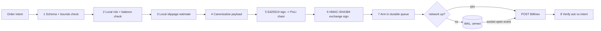

# 02 - Bitfinex Local Pre-Flight Verification Circuit

**Axis:** Tether appeal / Capabilities. **Status:** [PARTIAL] (calc + risk + PoLI shipped),
[BLUEPRINT] (durable queue + armed-fire-on-reconnect).

## Reality check

- **Two distinct signing layers — do not conflate them:**
  1. *Exchange auth* uses Bitfinex's real scheme: **HMAC-SHA384** over the request body
     with an API secret and a strictly increasing nonce. This is what authenticates the
     order to Bitfinex. It is NOT Ed25519.
  2. *Internal integrity / provenance* uses **Ed25519** to sign the canonical order
     intent into our PoLI hash chain BEFORE it leaves the machine. This is our 'we can
     prove what we decided, offline and tamper-evident' story for the Tether judges.
- **'Microsecond latency the millisecond the network blinks back'** is not real over WAN
  TCP+TLS to Bitfinex (RTT is tens of ms). The honest, still-impressive claim:
  *event-driven flush within a few ms of socket re-open*, with orders pre-signed so the
  only thing left at reconnect is the send — no compute on the hot path.

## The circuit: nothing touches the network until it passes local gates



### Gate 1 — Schema + bounds (deterministic)
Reject if symbol unknown, side not in {buy,sell}, amount<=0, price<=0 (for limit),
notional outside `[NYX_MIN_NOTIONAL, NYX_MAX_NOTIONAL]`, leverage above cap. Pure code,
no model. Fast-fails the obvious.

### Gate 2 — Local risk + balance
- Position sizing from `src/trade/calculator.js`: risk_amount = equity * risk_pct;
  size = risk_amount / (entry - stop) for the chosen symbol.
- Balance pre-check against the last cached wallet snapshot (so we never *send* an order
  we know will be rejected for insufficient funds while offline).
- Pre-trade hardware risk from doc 03 (`preTradeRisk`): block/raise-confirm if CPU>85%,
  RAM>90%, or latency to exchange is null/high.

### Gate 3 — Local slippage estimate (the model + math)
Deterministic core, model as explainer:
```
est_fill = VWAP over cached order-book depth until cumulative size >= order size
slippage_bps = 10000 * (est_fill - mid) / mid       // signed by side
if slippage_bps > NYX_MAX_SLIPPAGE_BPS: require explicit confirm
```
The local Psy model does NOT invent numbers — it receives the computed `slippage_bps`,
`est_fill`, depth gaps, and produces the human rationale ('depth thin above 65k, expect
~12 bps; suggest a limit at ...'). Numbers are math; prose is the model. State that
clearly to judges — deterministic finance, narrated AI.

### Gate 4 — Canonicalization (critical for any signing)
Deterministic JSON: sorted keys, fixed decimal formatting (no float drift), explicit
nonce, `idempotencyKey = blake2s(symbol|side|amount|price|nonce)`. Same intent => same
bytes => same signatures => safe to retry without double-spend.

### Gate 5 — Ed25519 PoLI signature (offline provenance)
```
receipt = {
  ts, intentHash: blake2s(canon),
  decidedBy: 'local-psy' | 'groq',
  prevHash,                       // hash chain link
}
receipt.sig = ed25519.sign(receipt, deviceKey)
poli.append(receipt)              // src/poli.js, verifiable by verify.js
```
Now the order's existence and parameters are tamper-evident and provable offline.

### Gate 6 — HMAC-SHA384 exchange signature (Bitfinex real scheme)
```
nonce = String(Date.now() * 1000)                  // strictly increasing, microseconds
body  = canonicalBody
sigPayload = '/api/v2/auth/w/order/submit' + nonce + body
sig = hmacSHA384(sigPayload, apiSecret)            // hex
headers = { 'bfx-nonce': nonce, 'bfx-apikey': key, 'bfx-signature': sig }
```
Secret comes from the encrypted vault (`src/security/vault.js`), decrypted only in
memory under `NYX_VAULT_PASS`. Never logged, never written to the WAL in plaintext.

### Gate 7 — Arm in durable queue (offline resilience)
Append-only WAL on disk (`data/orders.wal`), each entry a state-stamped, already-signed
order. Crash-safe: on boot we recover armed orders. States:
```
queued -> validated -> signed -> armed -> sent -> acked | rejected | expired
```
Each armed order carries `expiresAt` (good-till) so a stale order never fires after the
market moved. This is the honest version of 'fire the millisecond the network returns':
the heavy work (validate, sign) is already done; the reconnect handler does only `send`.

### Gate 8 — Ack reconciliation
Compare the exchange ack (filled price, amount, order id) against `intentHash`. Append a
second PoLI receipt linking intent->execution. Mismatch (e.g. partial fill, price beyond
tolerance) raises an alert and halts the queue. Trust is bidirectional.

## Reconnect protocol (event-driven, not polling)
```js
net.on('online', async () => {
  for (const o of wal.armed().filter(o => o.expiresAt > now())) {
    try { const ack = await bfx.send(o); wal.mark(o.id, 'sent'); reconcile(o, ack) }
    catch (e) { wal.mark(o.id, 'rejected', e); break } // stop on first failure, stay safe
  }
})
```
A single socket-open event flushes the queue; no busy-wait, no per-order recompute.

## Safety defaults (Zero-Trust)
- `NYX_LIVE_TRADING=0` => everything above runs in DRY-RUN: it validates, signs the PoLI
  receipt, arms the queue, but the final `bfx.send` is mocked. Judges see the full circuit
  with zero risk of a real fill. Live mode is one env flag, gated behind double confirm.
- The broker state machine (`src/trade/broker.js`) already enforces confirm_final before
  any submit; this circuit sits between 'confirm' and 'send'.

## Integration points
- `src/trade/calculator.js` — sizing, slippage math (Gate 2,3).
- `src/trade/broker.js` — call the circuit at `confirm_final`.
- `src/integrations/bitfinexAuth.js` — HMAC-SHA384 + nonce (Gate 6).
- `src/security/vault.js` — secret decryption (Gate 6).
- `src/poli.js` — Ed25519 receipts (Gate 5,8).
- New: `src/trade/orderQueue.js` — the WAL + reconnect flush (Gate 7).

## Demo to judges
Go offline, place an auto order. Show: validation passes, PoLI receipt written
(`verify.js` => PASS), order shows `armed` in the queue. Reconnect => it sends within ms,
ack reconciled, second PoLI receipt links intent to fill. All in DRY-RUN.
