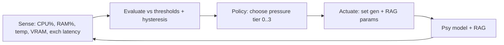

# 03 - Hardware Telemetry to Dynamic-Hyperparameter Reaction Loops

**Axis:** Complexity / Capabilities. **Status:** [SHIPPED] sampler, [BLUEPRINT] controller.

## Reality check
- `os.loadavg()` is 0 on Windows; we already sample real CPU via `os.cpus()` time deltas
  (`src/system/specs.js` `sampleCpuLoad`). That is shipped and honest.
- **VRAM page faults** are not exposed by Node cross-platform. Real sources: `nvidia-smi`
  (NVIDIA), Windows `Win32_VideoController` (total VRAM only), or the QVAC/llama runtime's
  own counters. We read what exists and degrade gracefully where it does not. We never
  fabricate a VRAM metric we cannot read.
- The current RAG (`src/rag.js`) is keyword TF, not vectors. 'Semantic quantization of
  embeddings' is therefore a [BLUEPRINT] that activates once the embedding index lands.

## The loop: a real closed-loop controller, not text passing



Sampling cadence: 1 Hz idle, 4 Hz during an active generation or trade burst. Cheap
(one cpus() delta + meminfo read). Latency from spike to reaction: <= 250 ms.

## Pressure tiers (the control law)

We avoid a fragile per-metric PID and use a **pressure index** with hysteresis (PID-style
smoothing optional). Compute a 0..1 pressure per resource, take the max, map to a tier.

```
p_cpu  = clamp((cpu%  - 60) / 35, 0, 1)
p_ram  = clamp((ram%  - 70) / 25, 0, 1)
p_temp = clamp((tempC - 75) / 20, 0, 1)   // only if temp readable
p_vram = clamp((vram% - 80) / 18, 0, 1)   // only if vram readable
P = max(p_cpu, p_ram, p_temp, p_vram)
```

Hysteresis: tier only *rises* when P crosses the up-threshold for 2 samples, and only
*falls* after 4 samples below the down-threshold. Prevents parameter flapping mid-answer.

| Tier | P range | num_predict (max tokens) | temperature | top_p | history turns | RAG top-k | RAG precision |
|------|---------|--------------------------|-------------|-------|---------------|-----------|----------------|
| 0 Calm   | 0.0-0.25 | 512 | 0.7 | 0.95 | 8 | 5 | fp32 |
| 1 Warm   | 0.25-0.5 | 384 | 0.5 | 0.9  | 6 | 4 | int8 |
| 2 Hot    | 0.5-0.8  | 256 | 0.3 | 0.85 | 4 | 3 | int8 + dim-drop |
| 3 Critical | 0.8-1.0 | 160 | 0.2 | 0.8  | 2 | 2 | int4 / cache-only |

Rationale (defensible to judges):
- **num_predict down** is the single biggest lever: it bounds compute and memory linearly.
- **temperature/top_p down** under pressure makes decode cheaper to *finish* (less
  wandering, fewer tokens to reach a stop) and more deterministic when we are degraded.
- **history turns down** shrinks the prompt => smaller KV-cache => less RAM/VRAM.
- **RAG top-k + precision down** is the embedding-pressure valve (below).

## Semantic quantization of RAG under RAM pressure ([BLUEPRINT])

When the embedding index exists, embeddings dominate RAM (e.g. 50k chunks * 768 dims *
4 bytes = ~150 MB fp32). Under tiers 1-3 we shrink the *working set*, not the source:

1. **Scalar int8 quantization**: store per-vector scale s; q = round(v / s) in int8.
   8 bits vs 32 => 4x smaller; cosine error typically <1% — negligible for top-k recall.
2. **Dimension drop (PCA-lite)**: keep the top-D principal dims precomputed offline; at
   tier 2 use D=256 of 768. ~3x smaller, recall drop small for short FAQ-style chunks.
3. **Product quantization (PQ)** at tier 3: split vector into m sub-vectors, each mapped
   to a 256-entry codebook => ~m bytes/vector (e.g. 16 bytes vs 3072). Massive shrink,
   approximate recall — acceptable when the alternative is OOM.
4. **Cache-only mode** (tier 3 extreme): skip live retrieval; answer from the signed
   semantic cache (doc 04) + parametric knowledge only.

Key honesty: these are *lossy*. We expose the active tier in the UI ('eco mode') so the
user knows quality was traded for survival. Degrade visibly, never silently.

## Actuation protocol

```
ControllerState = { tier, since, params }
on each sample:
  P = pressure()
  tier' = mapTier(P, with hysteresis)
  if tier' != tier: params = TIERS[tier']; engine.setParams(params); ui.badge(tier'); poli.note(tier')
```

`engine.setParams` writes into the provider call options:
- Ollama: `options.num_predict`, `options.temperature`, `options.top_p`, `options.num_ctx`.
- QVAC SDK: the equivalent completion knobs + max tokens.
- RAG: `retrieve(query, k, { precision })`.

We also feed the tier into doc 02: at tier 3 during a trade burst, `preTradeRisk` raises
confirmation ('machine under load, confirm before firing').

## Pseudocode (controller)

```js
import { collectSpecs } from '../system/specs.js'
const TIERS = [ /* table above */ ]
let tier = 0, up = 0, down = 0

export function startController(engine) {
  setInterval(async () => {
    const s = await collectSpecs()                 // shipped sampler
    const P = pressure(s)
    const t = nextTier(P)                           // hysteresis on up/down counters
    if (t !== tier) {
      tier = t
      engine.setParams(TIERS[t])
      rag.setPrecision(TIERS[t].ragPrecision)
      ui.ecoBadge(t)
      poli.note({ kind: 'throttle', tier: t, P })   // provenance: we logged the trade-off
    }
  }, activeGeneration ? 250 : 1000)
}
```

## Integration points
- `src/system/specs.js` — `sampleCpuLoad`, `collectSpecs`, add optional `nvidia-smi` read.
- `src/llm/providers.js` — accept dynamic `num_predict/temperature/top_p/num_ctx`.
- `src/rag.js` — add `setPrecision()` + quantized index (blueprint).
- `src/poli.js` — log throttle events so the trade-off is auditable.
- New: `src/system/controller.js` — the loop.

## Demo to judges
Start a heavy generation, then `stress-ng --cpu 8` (or open a big build). Watch the eco
badge climb 0->3 live, tokens-per-answer shrink, the machine stay responsive, and the
PoLI log record each tier change. Then stop the load and watch it relax back to tier 0.
