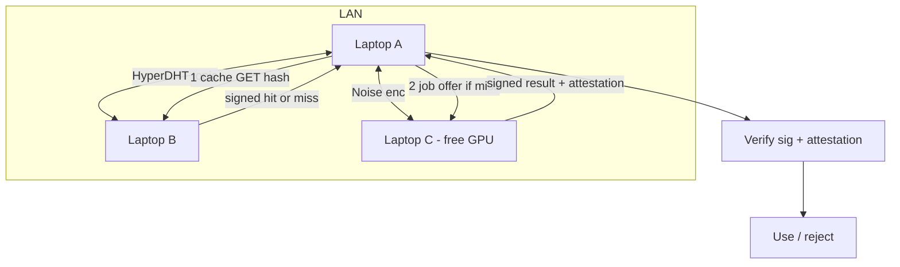

# 04 - P2P DHT Load Distribution (Holepunch-Inspired)

**Axis:** Innovation / the flex. **Status:** [BLUEPRINT] (built on shipped WDK scaffold).

## Reality check (this is where most demos lie — we will not)

Holepunch veterans will instantly call out fantasy, so we lead with the hard truths:

1. **Naive tensor/pipeline parallelism of a 2-3 GB model across consumer laptops over
   Wi-Fi is a net LOSS.** Per-token, pipeline parallelism must ship activations between
   stages every layer-group. A 3B model at, say, 2560 hidden dims in fp16 => ~5 KB per
   token per cut point, but the killer is *latency*, not bandwidth: each token needs a
   round trip per stage. LAN RTT ~0.3-2 ms * (layers/stage) * tokens dominates the ~10-30
   ms/token local decode. You make generation slower. We therefore **do not recommend
   layer-split pipeline parallelism** and we say so. The math is in the appendix.

2. **'Share cached weights across devices'** — sharing *weights* saves a one-time
   download, not inference cost, and risks shipping tampered weights. We share **signed
   responses and KV/prefix caches**, with attestation, which is both safe and actually
   useful.

What *is* a genuine, brain-tickling flex and is correct:

- **A signed semantic-cache mesh** over HyperDHT: peers answer each other's repeated
  prompts instantly, every answer carrying a PoLI signature so you can *trust without
  trusting the peer*.
- **Request-level offload** (a.k.a. horizontal sharding): a peer with a free GPU runs the
  *whole* job; the requester verifies via attestation. Coarse-grained => latency-tolerant.
- **Speculative decoding split**: a fast small draft model on device A proposes tokens; a
  bigger model on device B verifies in batches. This tolerates LAN latency because
  verification is batched, and it genuinely speeds up decode. This is the real 'split the
  inference' answer.

## Transport & discovery (Holepunch stack)

- `hyperswarm` / `hyperdht` for NAT-traversing peer discovery by **topic** = a hash of a
  shared room key (e.g. `blake2s('nyx-mesh:' + lanSecret)`), so only devices that share
  the secret form the mesh. No internet, no central server — pure DHT.
- Per-connection Noise encryption (built into Holepunch) — confidential and authenticated
  at the transport layer.
- Each peer has a stable Ed25519 identity (same key used for PoLI in doc 02), so a peer's
  signatures are attributable across sessions.



## Subsystem 1 - Signed semantic-cache mesh

Content-addressed cache. Key = `blake2s(normalize(prompt) + modelId + paramsTier)`.
Value = `{ answer, modelId, sig, signerPubKey, attestation }`.

Protocol:
```
CACHE_GET(key)        -> CacheHit{value} | Miss
CACHE_PUT(key, value) -> ack            // value.sig = ed25519.sign(answer+meta)
```
Trust rule (non-negotiable): a peer's cache hit is used ONLY if
`ed25519.verify(sig, answer, signerPubKey)` passes AND the model attestation
(`src/attestation.js`, SHA-256 of weights) matches a model we accept. Otherwise treat as
untrusted data and ignore. This is the part that wins crypto judges: *the cache is
decentralized but every entry is verifiable*. A malicious peer cannot poison you.

Latency win: a cross-device cache hit is one DHT round trip (~ms on LAN) vs hundreds of ms
to regenerate. Real, honest, and measurable.

## Subsystem 2 - Request-level offload (the practical 'load split')

Used when local telemetry (doc 03) is at tier 2-3 (this machine is hot) but a peer is calm.

```
LOAD_BEACON{ peerId, freeRamGB, gpu, tierP, modelId }   // gossiped every 2s
JOB_OFFER{ jobId, promptHash, maxTokens, bountyUSDt }    // requester -> best peer
JOB_ACCEPT{ jobId, etaMs }
JOB_RESULT{ jobId, answer, sig, attestation }
SETTLE{ jobId, amountUSDt }                              // WDK gasless, doc: p2p/payments.js
```

Scheduler: pick the peer minimizing `score = etaMs + lambda * tierP_peer`, excluding peers
whose attestation we do not accept. The requester verifies the signed result; only then
does it settle micro-payment in USD₮ via the shipped WDK scaffold. This ties the mesh to
Tether's 'machine economy' thesis with a real, signed, paid unit of work.

Why this is the right granularity: one network round trip per *job*, not per *token*. It
is latency-tolerant, trivially parallel across many chats, and it degrades to local
execution if no peer qualifies.

## Subsystem 3 - Speculative decoding split (the genuine inference split)

The only token-level split that *beats* local latency over a LAN:
```
Device A (draft): small fast model proposes k tokens t1..tk
Device B (target): big model verifies all k in ONE forward pass (batched)
  - accept the longest correct prefix, resample the first divergence
Net: B does fewer sequential steps; A hides B's RTT behind drafting.
```
This works because verification is *batched* (one round trip per k tokens, not per token),
so a 0.5-2 ms LAN RTT is amortized over k. Honest caveat: requires both models to share a
tokenizer/vocab and the QVAC SDK to expose logits for verification; if it does not, this
stays a blueprint and we fall back to Subsystem 2.

## Security model (must state explicitly)
- All peer-provided text is **untrusted data** => routed through the injection firewall
  (`src/security/injection.js`) and never executed as instructions.
- Results are trusted only with valid Ed25519 signature + accepted attestation.
- Mesh membership gated by shared `lanSecret`; transport encrypted (Noise).
- Payments are post-verification only; an unverifiable result is never paid and is dropped.

## State machine (requester side)
```mermaid
stateDiagram-v2
  [*] --> LOCAL_TRY
  LOCAL_TRY --> CACHE_LOOKUP: prompt hashed
  CACHE_LOOKUP --> USE_CACHE: signed hit verified
  CACHE_LOOKUP --> DECIDE: miss
  DECIDE --> LOCAL_RUN: machine calm or no peer
  DECIDE --> OFFER: machine hot and calm peer exists
  OFFER --> VERIFY: JOB_RESULT received
  VERIFY --> SETTLE: sig + attestation OK
  VERIFY --> LOCAL_RUN: verification failed (never trust)
  SETTLE --> [*]
  LOCAL_RUN --> CACHE_PUT --> [*]
  USE_CACHE --> [*]
```

## Integration points
- New: `src/p2p/mesh.js` — hyperswarm topic join, beacons, job RPC.
- New: `src/p2p/cache.js` — content-addressed signed cache (wraps `src/rag.js` cache).
- `src/attestation.js` — model weight hash check for accepting peer results.
- `src/poli.js` — sign cache entries and job results.
- `src/p2p/payments.js` + `src/wallet/wdk.js` — gasless USD₮ settlement (shipped scaffold).
- `src/security/injection.js` — sanitize all peer text.

## Appendix - why per-token pipeline parallelism loses (the math to show judges)
```
Local decode:      ~T_local per token (e.g. 20 ms on a 3B q4 on a laptop)
Pipeline (2 nodes): per token must cross the cut once each direction
  T_pipe ~= T_compute/2 + 2 * RTT + serialize
  with RTT ~0.5-2 ms LAN and per-token sync, the 2*RTT * tokens term and the
  inability to batch across the cut make T_pipe >= T_local in practice.
Conclusion: shard whole JOBS (latency amortized once) or use speculative decoding
(latency amortized over k tokens). Do NOT split layers per token. We ship the
latency-tolerant designs and document why, which is itself the senior-engineer signal.
```

## Demo to judges
Run the app on two laptops on the same Wi-Fi with the same room secret. Ask laptop A a
question laptop B already answered => instant signed cache hit (show the signature verify).
Then pin laptop A's CPU (doc 03 tier 3) and ask a fresh question => job offloads to B,
result verified, micro-paid in USD₮, PoLI receipts on both sides. No internet the whole time.
